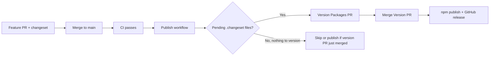

# Releasing (maintainers)

This repo uses **[Changesets](https://github.com/changesets/changesets)** for semver, changelogs, GitHub releases, and npm publish.

## How it works (two phases)



**Phase 1 — version (no npm upload)**  
You merge feature work that includes a `.changeset/*.md` file. The **Publish** workflow sees pending changesets and opens a **“Version Packages”** PR. That PR only updates `package.json`, `CHANGELOG.md`, and related files.

**Phase 2 — publish**  
You merge the Version Packages PR. The next run has **no** pending changesets, so the workflow runs **`npm publish --access public`**. Authentication uses **[npm Trusted Publishing](https://docs.npmjs.com/trusted-publishers)** (OIDC). There is no `NPM_TOKEN` secret. One-time npm/GitHub setup: **[docs/GITHUB_SETUP.md](docs/GITHUB_SETUP.md)**.

`prepublishOnly` runs build, typecheck, and tests before publish.

## Day-to-day routine

1. On each **user-facing** PR: `pnpm changeset` and commit the file under `.changeset/`.
2. Merge to **`main`** and wait for **CI**.
3. If **“Version Packages”** appears → review `CHANGELOG.md` → merge it.
4. After that merge, **Publish** uploads to npm and creates the GitHub release.

You do not run `npm publish` locally unless CI is broken.

## Versioning rules (semver)

| Changeset type | When to use | Example |
|----------------|-------------|---------|
| **patch** | Bug fix, internal refactor, docs-only in package | Fix arc radius parsing |
| **minor** | New entity, new API, backward compatible | Add type 102 composite curve |
| **major** | Breaking API or behavior | Remove export, change `parse()` return type |

Pre-1.0 (`0.x`) packages may use minor for breaking changes if you prefer — document in the changeset summary.

## Commands (local)

```bash
pnpm changeset              # add a new changeset (interactive)
pnpm changeset status       # see pending releases
pnpm version-packages       # bump versions locally (usually let CI do this)
```

## What gets published

| Package | npm | Notes |
|---------|-----|--------|
| `three-iges-loader` | ✅ [npm](https://www.npmjs.com/package/three-iges-loader) | Public; bundles `iges-core` |
| `iges-core` | ❌ | `private: true` workspace package |

To publish `iges-core` separately later: remove `private`, remove from `ignore` in `.changeset/config.json`, and add a `linked` or `fixed` group in Changesets config.

## GitHub & npm setup

One-time configuration: **[docs/GITHUB_SETUP.md](docs/GITHUB_SETUP.md)**.

## Troubleshooting

| Problem | Check |
|---------|--------|
| Version PR never opens | Changeset file merged to `main`? `publish.yml` enabled on `main`? |
| Publish fails | Trusted Publishing: workflow **`publish.yml`**, repo match, `id-token: write` |
| `ENEEDAUTH` / 401 | Trusted publisher not configured or wrong workflow filename on npm |
| Wrong version bumped | Changeset type in `.changeset/*.md` |
| Changelog missing PR links | `@changesets/changelog-github` repo in `.changeset/config.json` |

## Manual publish (emergency only)

```bash
pnpm install
pnpm changeset version   # if versions not bumped yet
pnpm build && pnpm test
npm publish --access public
git tag vX.Y.Z && git push origin vX.Y.Z
```

Prefer fixing CI so provenance and changelogs stay consistent.
