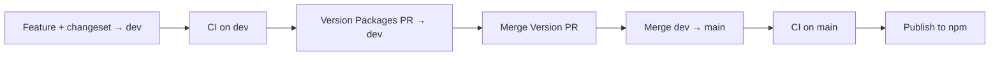

# Releasing (maintainers)

This repo uses **[Changesets](https://github.com/changesets/changesets)** for semver, changelogs, GitHub releases, and npm publish.

## Branches

| Branch | Role |
|--------|------|
| **`dev`** | Integration — features, Dependabot, **Version Packages** PRs |
| **`main`** | Release line — merge `dev` here to ship to npm |

## How it works



**Phase 1 — version (on `dev`)**  
Merge feature work with a `.changeset/*.md` file to **`dev`**. After CI passes, **Publish → Version packages (dev)** opens a **“Version Packages”** PR against `dev` (bumps `package.json`, updates `CHANGELOG.md`).

**Phase 2 — ship (merge to `main`)**  
Review and merge the Version Packages PR on `dev`, then merge **`dev` → `main`** only when the version in `package.json` is **not yet on npm**. After CI on `main`, **Publish → Publish to npm** runs only for unpublished versions (strict `npm publish` — fails if the version already exists).

Changelog entries come from changeset summaries and `@changesets/changelog-github` (links PRs/issues). You do not edit `CHANGELOG.md` by hand for releases.

## Maintainer routine

1. Merge feature PRs to **`dev`** (each user-facing change includes a changeset).
2. When **Version Packages** opens on `dev` → review `CHANGELOG.md` → merge it.
3. Merge **`dev` → `main`** when ready to release.
4. Confirm **Publish** on `main` succeeds.

## Versioning rules (semver)

| Changeset type | When to use | Example |
|----------------|-------------|---------|
| **patch** | Bug fix, internal refactor, docs-only in package | Fix arc radius parsing |
| **minor** | New entity, new API, backward compatible | Add type 102 composite curve |
| **major** | Breaking API or behavior | Remove export, change `parse()` return type |

Pre-1.0 (`0.x`) packages may use minor for breaking changes if you prefer — document in the changeset summary.

## Commands (local)

```bash
pnpm changeset              # add a new changeset (interactive)
pnpm changeset status       # see pending releases
pnpm version-packages       # bump versions locally (usually let CI do this)
```

## What gets published

| Package | npm | Notes |
|---------|-----|--------|
| `three-iges-loader` | ✅ [npm](https://www.npmjs.com/package/three-iges-loader) | Public; bundles `iges-core` |
| `iges-core` | ❌ | `private: true` workspace package |

To publish `iges-core` separately later: remove `private` from `packages/iges-core/package.json` and add a `linked` or `fixed` group in `.changeset/config.json`.

## GitHub & npm setup

One-time configuration: **[docs/GITHUB_SETUP.md](docs/GITHUB_SETUP.md)**.

## Troubleshooting

| Problem | Check |
|---------|--------|
| Version PR never opens | Changeset merged to **`dev`**? CI passed on `dev`? |
| Publish fails with “already published” | `main` has a version already on npm — merge a **Version Packages** bump on `dev` first, then merge `dev` → `main` again |
| Publish job skipped on `main` | Expected when merging `dev` → `main` without a new version (e.g. workflow-only changes); check **Check unpublished version** job summary |
| `ENEEDAUTH` / 401 | Trusted Publishing: workflow **`publish.yml`**, repo match, `id-token: write` |
| Wrong version bumped | Changeset type in `.changeset/*.md` |

## Manual publish (emergency only)

```bash
pnpm install
pnpm changeset version   # if versions not bumped yet
pnpm build && pnpm test
npm publish --access public
git tag vX.Y.Z && git push origin vX.Y.Z
```

Prefer fixing CI so provenance and changelogs stay consistent.
